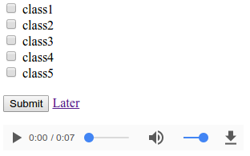

# AudioLabeler
Simple web app for labeling audio clips.  The web app is no frills and can easily be modified for other projects.  The results are stored in csv file (by default this file is named `record.csv`).



## Setup
Place all data in a data folder within the static folder. Chaning `settings/settings.json` to have the correct class labels.


## Run
```bash
export FLASK_APP=run.py
flask run
```


## Requirements
* Flask
* Python 3.6
* Google Chrome

## Acknowledgements 

This work is based off of [USC supervising UI](https://github.com/USCDataScience/supervising-ui).  The provided audio examples are from [LJ-Speech-Dataset](https://keithito.com/LJ-Speech-Dataset/).

## Sample Audio

<audio controls>
    <source src="static/data/LJ025-0076.wav" type="audio/wav">
</audio>